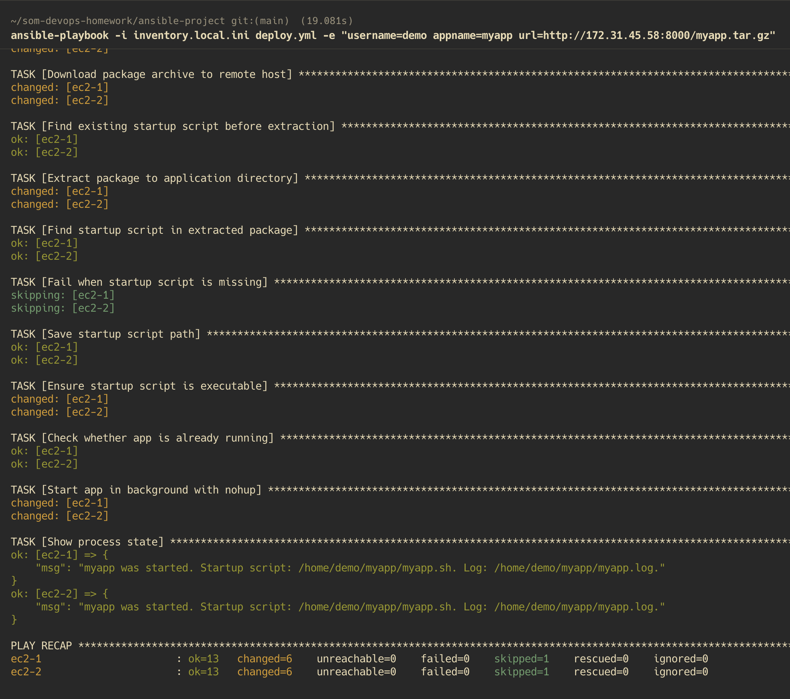
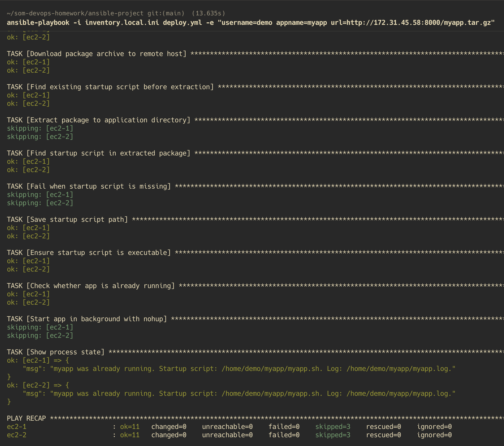
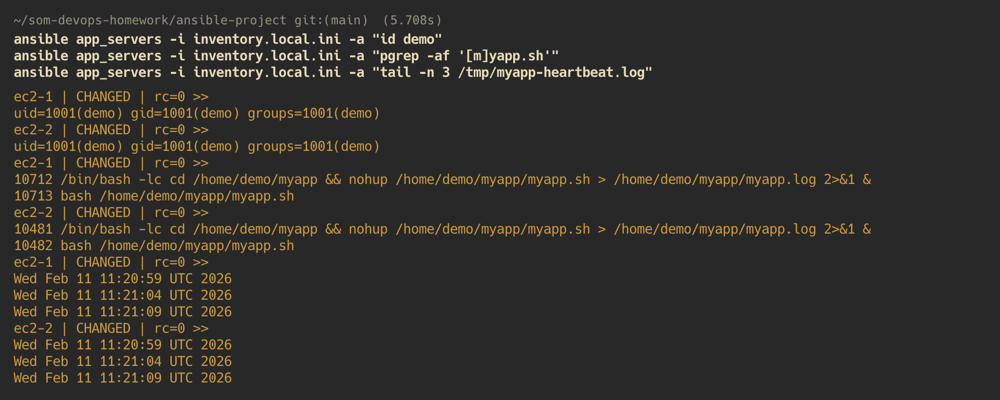

# Ansible deployment demo

This folder contains a simple Ansible project for the DevOps homework.

It implements all requested requirements:

1. accept `username`, `appname`, `url` as input
2. create a new Linux user
3. download package from `url`
4. extract package into that user home directory
5. start `appname.sh` in background

## Files

- `deploy.yml` - main playbook
- `inventory.ini` - target Linux hosts
- `ansible.cfg` - local Ansible defaults for this folder

## Prerequisites

- Ansible installed on your control machine
- SSH access to one or more Linux servers
- sudo privileges on target servers (for user creation and file ownership)
- a package URL reachable from target servers


## 1) Configure target servers

Edit `inventory.ini`:

```ini
[app_servers]
server1 ansible_host=192.168.56.101 ansible_user=ubuntu ansible_ssh_private_key_file=~/.ssh/id_rsa
# server2 ansible_host=192.168.56.102 ansible_user=ubuntu ansible_ssh_private_key_file=~/.ssh/id_rsa
```

Replace:

- `ansible_host` with server IP or DNS name
- `ansible_user` with SSH login username

Common per-host SSH key variable:

```ini
ansible_ssh_private_key_file=~/.ssh/id_rsa
```

## 2) Test connectivity

From the `ansible-project` directory:

```bash
ansible app_servers -m ping
```

## 3) Run the playbook

Use vars to provide required input:

```bash
ansible-playbook deploy.yml \
  -e "username=demo appname=myapp url=https://example.com/myapp.tar.gz"
```

You can also use a vars file:

```bash
cp vars.example.yml vars.yml
# edit vars.yml with real values
ansible-playbook deploy.yml -e "@vars.yml"
```

Optional flags during testing:

- syntax check only:

```bash
ansible-playbook deploy.yml --syntax-check
```

- dry run (no changes):

```bash
ansible-playbook deploy.yml \
  -e "username=demo appname=myapp url=https://example.com/myapp.tar.gz" \
  --check --diff
```

## 4) Verify result on server

```bash
ansible app_servers -a "id demo"
ansible app_servers -a "ls -la /home/demo"
ansible app_servers -a "pgrep -af myapp.sh"
```

If process is not running, check log:

```bash
ansible app_servers -a "cat /home/demo/myapp/myapp.log"
```

## 5) Idempotency check

Run the same playbook command again.

Expected behavior:

- user creation task should be `ok`
- app directory task should be `ok`
- package download task should be `ok` when remote file is unchanged
- extraction task should be skipped unless package changed or startup script is missing
- app start task should not start duplicate process if already running
- steady-state rerun should show `changed=0`

## How `deploy.yml` works (task by task)

1. **assert**: validates `username`, `appname`, `url` are provided
2. **user**: creates `username` account and home directory
3. **file**: creates `/home/<username>/<appname>`
4. **get_url**: downloads package to `/tmp/<archive_name>`
5. **unarchive**: extracts package only when a new archive version is downloaded, or if startup script is missing
6. **find**: searches extracted files for `<appname>.sh`
7. **file**: marks startup script executable (`0755`)
8. **command (pgrep)**: checks whether app is already running
9. **command (sudo -u + nohup)**: starts script in background if not running
10. **debug**: prints whether app was started or already running

## Expected package format

The archive should contain a startup script named exactly:

```text
<appname>.sh
```

Example:

- if `appname=myapp`, archive must include `myapp.sh`
- provide any reachable archive URL that contains that startup script

The playbook searches recursively under `/home/<username>/<appname>` and uses the first match.


## Validation Evidence

Tested against 2 Linux hosts.

- First run deploys user, downloads package, extracts, and starts app.
- Second run is idempotent (`changed=0`).
- Verification confirms user exists, app process is running, and heartbeat log is updating.



